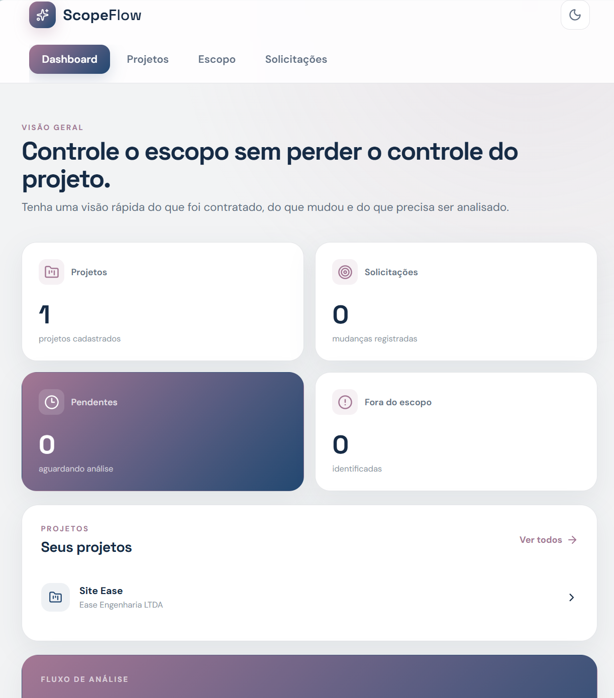
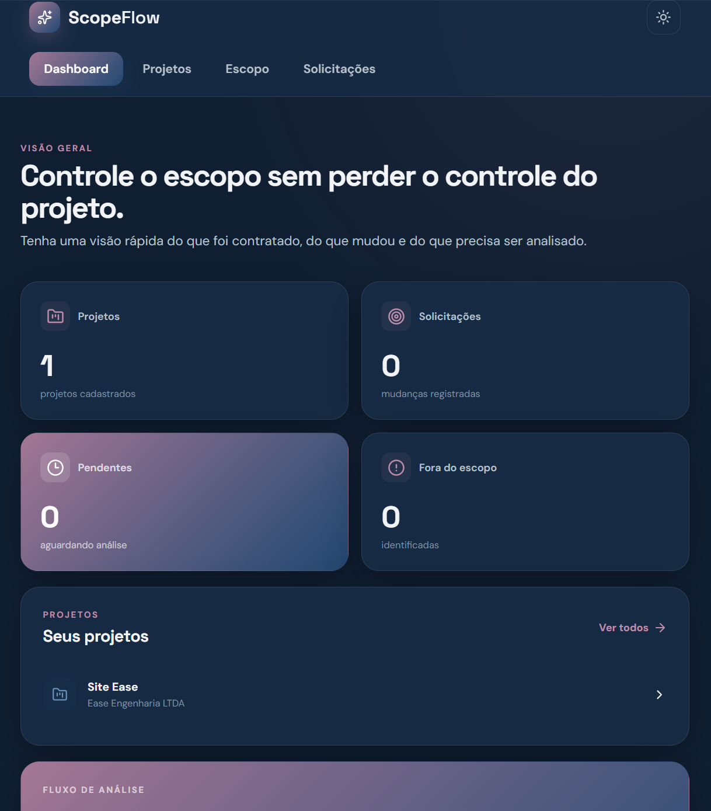
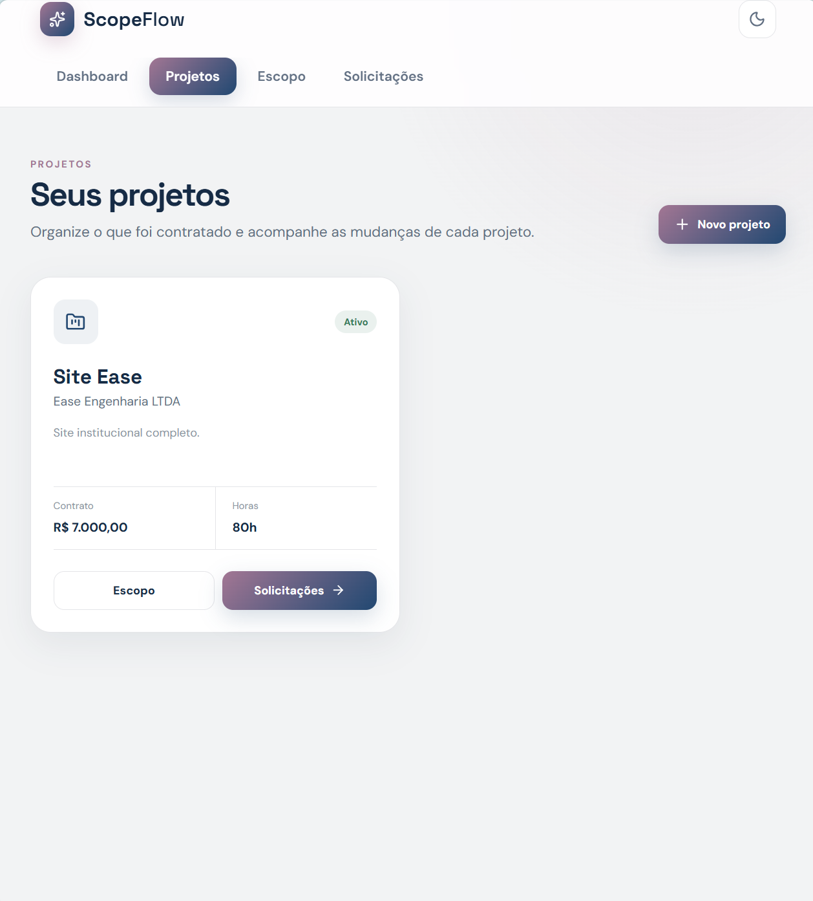
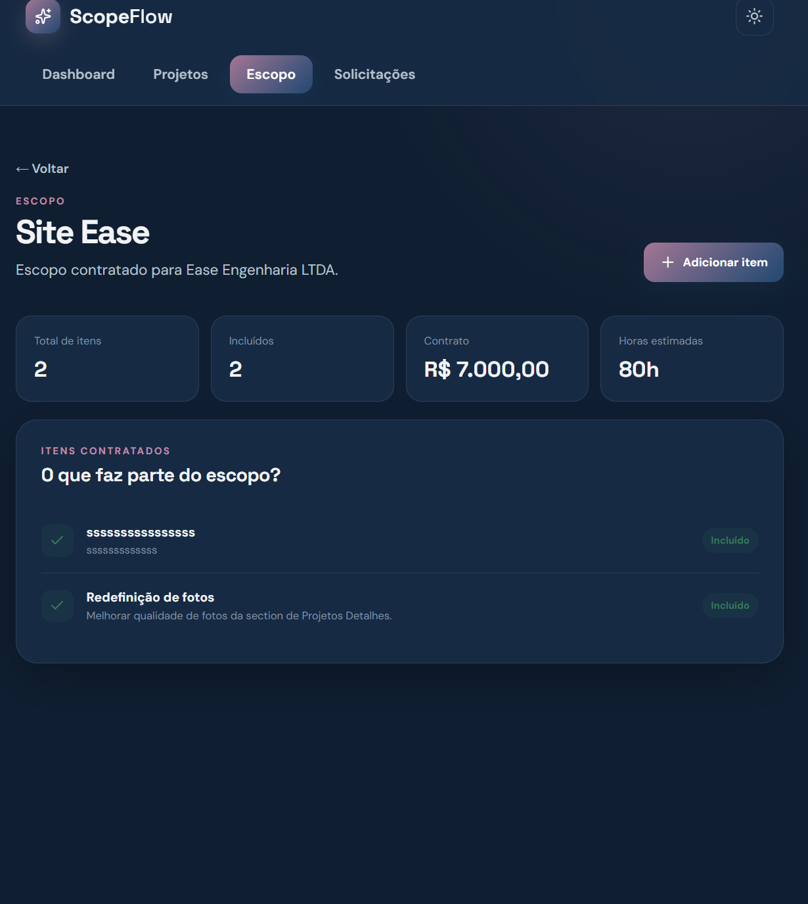
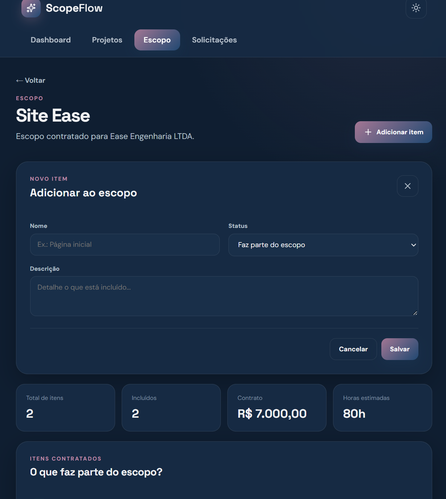
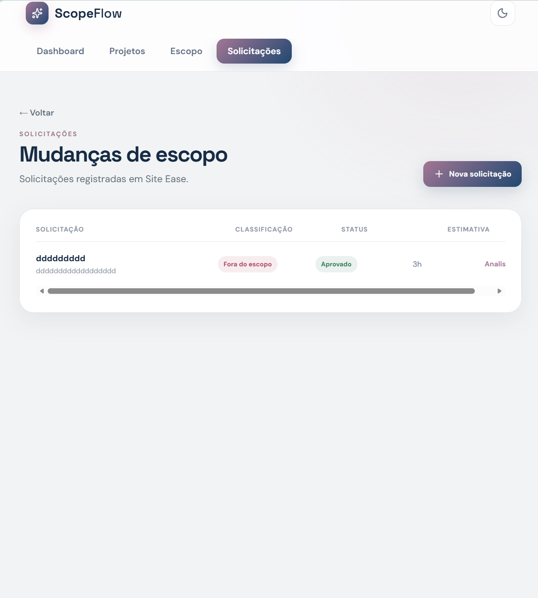

# ScopeFlow

ScopeFlow is a scope management application created to help freelancers keep track of what was agreed on in a project and identify when a client request becomes additional work.

The application allows projects and their scope to be registered, change requests to be analyzed, additional work to be estimated, and decisions to be recorded.

## Project Motivation

ScopeFlow was created from a problem I encountered while working as a freelancer.

During a project, it is common for new requests to appear that were not part of the original agreement. The difficult part is not only receiving these requests, but understanding whether they are already included in the scope or represent additional work.

I created ScopeFlow to solve this specific problem: keeping the original scope clear and making it easier to analyze, estimate, and decide how to handle new requests.

The goal was also to build a small but complete project to practice and demonstrate the development of a REST API with C# and ASP.NET Core, integrated with a React and TypeScript frontend.

## Features

- project management;
- scope definition;
- change request registration;
- scope analysis;
- estimated hours and additional cost;
- request status management;
- decision history;
- overview dashboard;
- responsive interface;
- REST API with OpenAPI documentation.

## Technologies

- C#
- ASP.NET Core
- Entity Framework Core
- SQLite
- OpenAPI
- Scalar
- React
- TypeScript
- Vite
- Lucide React

## Screenshots

<table>
  <tr>
    <td></td>
    <td></td>
  </tr>
  <tr>
    <td></td>
    <td></td>
  </tr>
  <tr>
    <td></td>
     <td></td>
  </tr>
</table>

## How It Works

The main workflow is:

```text
Project
   ↓
Scope
   ↓
Change Request
   ↓
Analysis
   ↓
Estimation
   ↓
Decision
